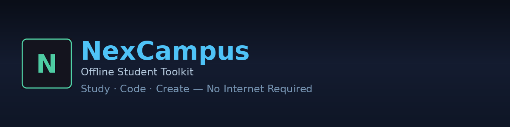
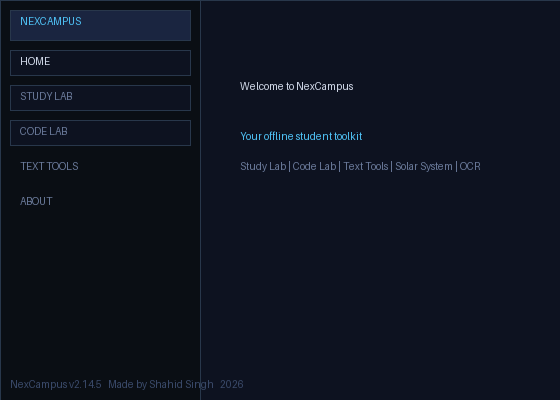
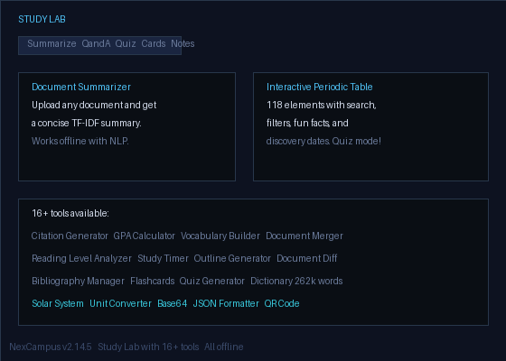
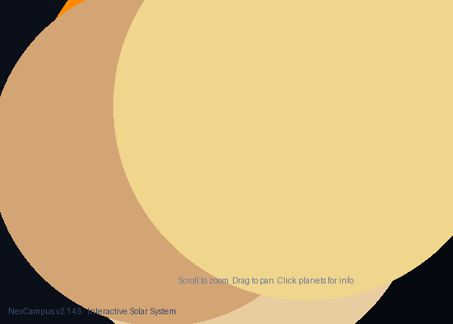
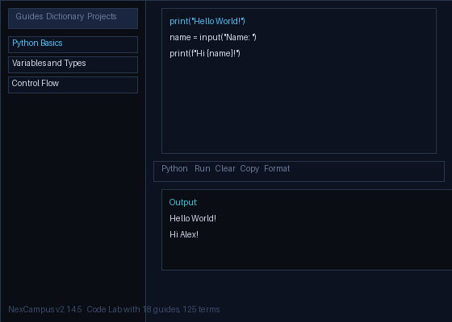

<p align="center">
  
</p>

<p align="center">
  <strong>Every student deserves free tools to learn, build, and create — no internet required.</strong>
</p>

<p align="center">
  
  
  
  
</p>

---

NexCampus is a fully offline desktop toolkit for students: Study Lab (16+ tools), Code Lab (18 guides, 125 terms, 11 projects), Text Tools (17), interactive Solar System, and OCR.

No signup. No ads. No tracking. No internet.

Built with Python + vanilla JS + pywebview. **249MB onefile binary** — everything bundled.

---

## Quick Install

**Linux:**
```bash
curl -sS https://raw.githubusercontent.com/sudobreakstuff/Nexcampus/main/install/install.sh | bash
```

**Windows (PowerShell):**
```powershell
irm https://raw.githubusercontent.com/sudobreakstuff/Nexcampus/main/install/install.ps1 | iex
```

**Uninstall:**
```bash
curl -sS https://raw.githubusercontent.com/sudobreakstuff/Nexcampus/main/install/uninstall.sh | bash
```

---

## Screenshots

<p align="center">
  
  
</p>

<p align="center">
  
  
</p>

---

## Features

### Study Lab (16+ tools)
Summarizer, Q&A, Quiz Generator, Flashcards, Notes (rich text editor), Citation Generator (MLA/APA/Chicago), Study Timer (Pomodoro), Reading Level Analyzer, Document Merger, GPA Calculator, Vocabulary Builder, Outline Generator, Document Diff, Bibliography Manager, Periodic Table (118 elements), Dictionary (262k+ words), Interactive Solar System

### Code Lab
18 Python guides, live code runner (Python/JS/Bash with cancel), 125-term programming dictionary, 11 practice projects, code snippet toolbar

### Text Tools (17)
Case Converter, Ciphers, Line Tools, Text Diff, AI-ism Scanner, Text Stats, Word Frequency, Entity Scanner, Hash Generator, Password Generator, Spell Check, Find & Replace, OCR (Tesseract 5.5), Unit Converter, Base64, JSON Formatter, QR Code Generator

### Solar System
900+ stars with twinkling, 8 planets + 5 dwarf planets, zoom/pan, Tour mode, keyboard navigation, shooting stars, lens flare, 54 fun facts, detailed planet profiles with discovery data

### Registry Plugin System
Add new tools safely without breaking existing code — uses `createElement`/`appendChild` (zero `innerHTML` strings). If one plugin fails, others keep working.

### Themes (9)
Retro Dark, Cyberpunk, Ocean Deep, Forest Night, Paper Light, Iron Man, Midnight Purple, Neon Tokyo, Sunset Glow

### Self-Update
Check for Updates from About page — downloads and installs automatically via CDN (no rate limits).

---

## What Makes NexCampus Different

| | |
|---|---|
| **Fully offline** | Tesseract 5 bundled, all tools work without internet |
| **No frameworks** | Pure vanilla JS + Python, no Electron or npm |
| **250MB binary** | Everything in one file — Python, JS, CSS, Tesseract, dictionary |
| **Code runner** | Execute Python, JavaScript, Bash with cancel support |
| **Tool Registry** | Plugin system for safe feature additions |
| **9 themes** | Find your style |
| **Self-updating** | One click, CDN-powered |

---

## Build from Source

```bash
git clone https://github.com/sudobreakstuff/Nexcampus.git
cd NexCampus
python3 server.py
```

Standalone binary:
```bash
pip install pyinstaller
bash build.sh        # Linux
build.bat            # Windows (requires Tesseract installed)
```

---

## Dependencies
- Python 3.8+
- libwebkit2gtk-4.1-0 (Linux, auto-installed by install script)
- Tesseract 5.5 (bundled in binary)

---

## License
MIT © Shahid Singh, NexCore Systems and Technologies
